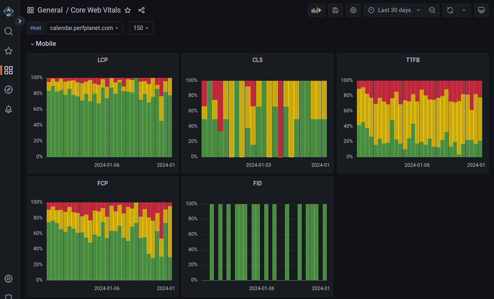

# Dashboard - Basic RUM



This is the visualization component of Basic RUM. It's nothing more than [Grafana](https://grafana.com/), few third-party Grafana plugins, Grafana dashboards configurations and a build script that puts everything together.

With the help of this project we keep the Grafana dashboards in source control and build Docker images that are used when we run all the Basic RUM components together.

**Docker repository:** https://hub.docker.com/r/basicrum/dashboard

## Third-Party Grafana plugins

 * Plotly panel - https://grafana.com/grafana/plugins/ae3e-plotly-panel/
   * By AE3E - https://github.com/ae3e/ae3e-plotly-panel
 * Altinity plugin for ClickHouse - https://grafana.com/grafana/plugins/vertamedia-clickhouse-datasource/
    * By Altinity - https://altinity.com

## Local development

### Prerequisites

 * Docker
 * Docker Compose
 * Node JS

### What do we run locally?

Locally with the help of Docker Compose we run our own image/build of Grafana and in addition we spin a Docker container for [ClickHouse](https://clickhouse.com/). We use ClickHouse as a data store that is being used for feeding with data the Grafana dashboards.

### File structure

 * `.github/workflows` - GitHub actions for running tests and automatic push to Docker Hub.
 * `artefacts` - Static files like icons and logos used during the build process for adding branding information.
 * `build` - This folder doesn't exist when we clone this repository. The folder is used during the build process to keep dashboards and datasources configurations.
 * `dashboards/defs` - Definitions/metadata information about the dashboards we are building.
 * `setup/ch` - Contains file used for provisioning ClickHouse locally. When the files are used required users and tables are being created in ClickHouse.
 * `src/lib` - Utility classes used for the dashboards build process.
 * `templates` - Contains configurations, SQL statements and Plotly JS specific JavaScript. The files in this folder are being used during the build process for creating the configuration for each individual Grafana panel.

## Local development workflow

We have a simple build script `build.js` based on Node JS. We need to make sure that the required Node JS modules are installed.

Run:
```
npm install
```

Once we are sure that we have initialized the Node JS part of the project we follow this workflow:

 1. Change things in `dashboards` or `templates` folders.
 2. Run `node build.js` .
 3. Run `make up` ... this is a wrapper around Docker Compose commands and will build and run the required Docker container.
 4. Load in the browser `http://localhost:3300/` in order to verify the changes.
    1. If you see a login screen type:
        1. Username: `admin`
        2. Password: `password`

